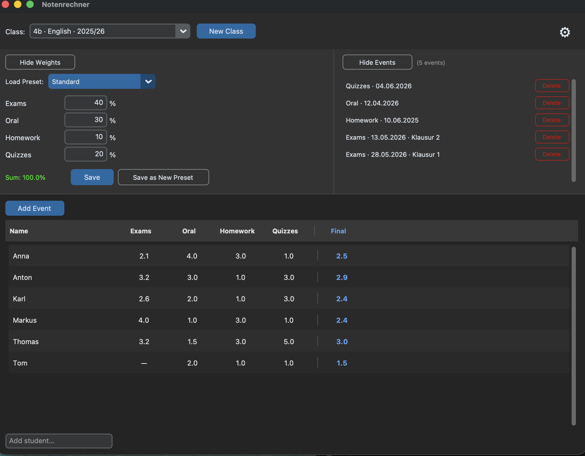
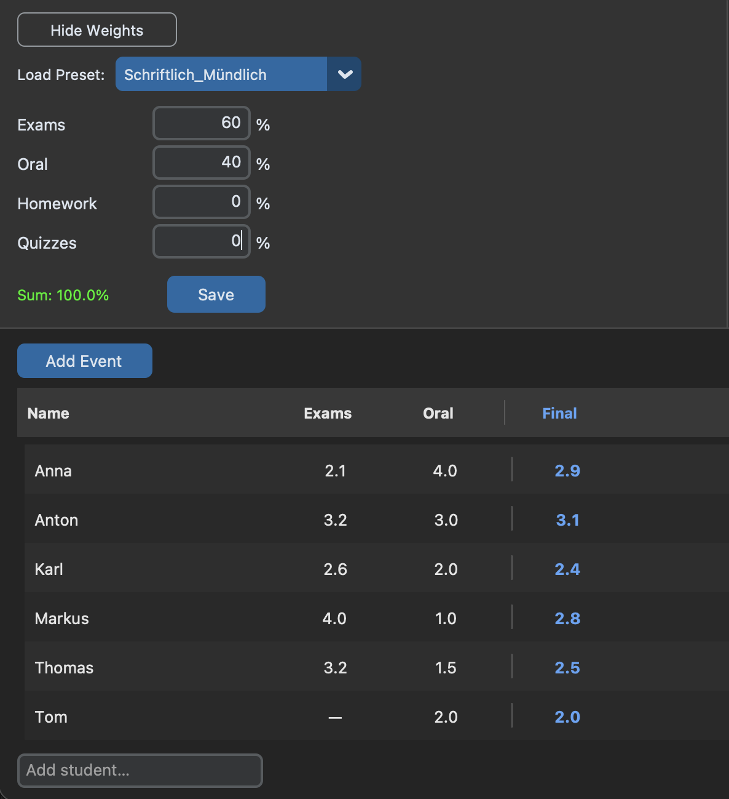

# Notenrechner — Teacher Guide

Da ich viele Lehrerinnen und Lehrer im Freundes- und Familienkreis habe und mitbekommen habe, dass das Eintragen und Ausrechnen von Noten oft noch klassisch mit Stift, Papier und Taschenrechner passiert, habe ich mich entschieden, als kleines Hobbyprojekt eine simple,intuitive und vor allem KOSTENLOSE App zu bauen.
Die App ermöglicht es, Noten schnell einzutragen und übersichtlich darzustellen.

Es gibt bereits viele Notenrechner- und Verwaltungsapps, aber diese sind entweder zu kompliziert in der Handhabung, haben ein sehr veraltetes Design oder kosten Geld.

Ich möchte euch die Chance geben, aktiv an der Gestaltung der App teilzunehmen.
Deshalb werde ich nach jedem größeren Appupdate eine kleine Feedbackrunde machen und euer Feedback dann auch direkt miteinfließen lassen.

Vielen Dank schon mal für eure Hilfe!

Liebe Grüße, Peer

---



---

## Feedback

This is an early version and your experience with it matters. If you have a few minutes, please fill out the short feedback form — it helps shape what gets built next.

**[→ Give feedback](https://docs.google.com/forms/d/e/1FAIpQLSeE-4u26JZE-SWuTIOBHFQ7Oof3R2aXr3Ax9JmUPsxeXuW8rQ/viewform)**

Any thoughts are welcome: what felt confusing, what worked well, what you wish the app could do.

---

## Installation

### Windows
1. Download `Notenrechne.exe` from the [Releases page](https://github.com/peerboku/notenrechner/releases)
2. Double-click to open — no installation needed
3. On first run the app creates a file called `grades.db` in the same folder. **Do not delete this file** — it contains all your data.

### Mac
1. Download `Notenrechner-mac.zip` from the [Releases page](https://github.com/peerboku/notenrechner/releases)
2. Unzip the file — you will get `Notenrechner.app`
3. Move it to your Applications folder or any folder you prefer
4. On first run the app creates a file called `grades.db` in the same folder as the app. **Do not delete this file** — it contains all your data.

> **First launch on Mac:** Because the app is unsigned, macOS will block it on first open. When you see the *"Not Opened"* warning, click **Done** (not Move to Trash). Then go to **System Settings → Privacy & Security**, scroll down, and click **Open Anyway**. Enter your Mac password when asked. You only need to do this once.
>
> Alternatively, open Terminal and run: `xattr -cr /Applications/Notenrechner.app` — then double-click normally.

---

## Upgrading from an Earlier Version

> **If you have used v0.3.x or earlier**, the database format has changed and your existing data is not compatible with v0.5.0. You will need to start fresh.

**Steps to upgrade:**

1. Optional: keep a copy of your old `Notenrechner.exe` and `grades.db` somewhere safe for reference.
2. Download the new `Notenrechner.exe` and place it in a folder of your choice.
3. Run the new version. It will create a new `grades.db` automatically.
4. Re-enter your classes and grades in the new interface.

---

## Aktuelle Version (v0.5.2)

Die App ist jetzt vollständig auf Deutsch. Die Oberfläche wurde nach einer Feedbackrunde mit Lehrerinnen und Lehrern überarbeitet — Schwerpunkt: einfacheres Eintragen von Noten und bessere Übersicht.

**Was in dieser Version funktioniert:**

- Klassen anlegen (Klasse, Fach, Schuljahr)
- Gewichtungen setzen und als Vorlagen speichern
- Schülerinnen und Schüler zur Klasse hinzufügen
- Noten klassenweise eintragen: Kategorie-Spalte anklicken, Datum und Notiz optional ergänzen, dann eine Note pro Schüler
- Kurznotation bei der Eingabe: `2+` (= 1,75), `2-` (= 2,25), `2-3` (= 2,5), Komma als Dezimalzeichen
- Diskrete Kategorien (Hausübungen, Tests) mit Symbolen: `+` / `~` / `−`
- Kategoriedurchschnitte und Endnote werden live angezeigt
- Klick auf Schülername → alle Noten werden aufgeklappt (Tabelle: Notiz | Datum | Kategorie-Spalten)
- Einträge löschen über das Einträge-Panel
- Gewichtungsvorlagen verwalten (erstellen, umbenennen, löschen) über das Zahnrad-Symbol
- Undo mit Ctrl+Z (Windows) bzw. Cmd+Z (Mac)

**Noch nicht verfügbar (kommt in einer späteren Version):**

- Detailansicht pro Schüler (Screen 2)
- Individuelle Gewichtungsausnahmen pro Schüler
- Drucken / PDF-Export

---

## The Main Screen

At the top, select which class you are working with using the dropdown. Use **New Class** to set one up.

**Schüler hinzufügen:** Klicke auf den Button „+ Schüler hinzufügen" am unteren Rand der Liste.

### Weight Panel

Shows the current category weights (Gewichtung) for the selected class. You can change the weights and click **Save** to apply them. The sum must equal 100% before saving is allowed.

Use **Load Preset** to apply a saved weight configuration. If you enter weights that don't match any existing preset, an option to **Save as New Preset** appears automatically. The dropdown always shows which preset is currently applied — when the panel is collapsed, the preset name appears next to the "Show Weights" button.

If you don't want to use all categories, just put 0 % for that category and it will automatically disappear from the student list viewer.

Beispiel: Nur Schularbeiten und Mündlich — Hausübungen und Tests auf 0 % setzen.




### Events Panel

Lists all grade events that have been saved for the current class. Click **Show Events** to expand it. Each event shows the category, date, and note. Use the **Delete** button to remove an event and all the grades linked to it — a confirmation will appear before anything is deleted.

### Schülerliste

Zeigt alle Schülerinnen und Schüler mit den aktuellen Kategoriedurchschnitten und der Endnote.

**Noten eintragen:**
Klicke auf den Spaltenkopf einer Kategorie (z. B. „Schularbeiten"). Die Liste wechselt in den Eingabemodus — du siehst eine Eingabezeile pro Schüler. Datum und Notiz kannst du optional in der Leiste oben ergänzen (Datum ist mit dem heutigen Tag vorausgefüllt). Schüler ohne Note einfach freilassen. Oben und unten gibt es jeweils einen **Speichern**-Button. Beim Speichern wird angezeigt, wie viele Schüler keine Note haben, und du kannst bestätigen.

Kontinuierliche Kategorien (Schularbeiten, Mündlich) akzeptieren auch Kurznotationen: `2+` (= 1,75), `2-` (= 2,25), `2-3` oder `2/3` (= 2,5), Komma als Dezimaltrennzeichen.

**Noten eines Schülers ansehen:**
Klicke auf den Namen des Schülers — darunter öffnet sich eine Tabelle mit allen eingetragenen Noten, geordnet nach Datum (neueste zuerst), mit Spalten für Notiz, Datum und jede Kategorie.

**Aktionsmenü (Schüler entfernen etc.):**
Klicke auf den **⋯**-Button am rechten Ende der Zeile.

**Letzten Eintrag rückgängig machen:** Ctrl+Z (Windows) bzw. Cmd+Z (Mac). Entfernt alle Noten des letzten Eintrags. Die Undo-Historie gilt nur für die aktuelle Sitzung.

---

## How Grades Are Calculated

Every student receives one final grade per course. That grade is built from up to four categories:

| Kategorie | Eingabe | Mögliche Werte |
|---|---|---|
| Schularbeiten | Kontinuierlich | Beliebige Zahl, z. B. 1 – 5 (auch 2+, 2-3 etc.) |
| Mündlich | Kontinuierlich | Beliebige Zahl, z. B. 1 – 5 |
| Hausübungen | Diskret | + (gut = 1), ~ (okay = 3), − (schlecht = 5) |
| Tests | Diskret | + (gut = 1), ~ (okay = 3), − (schlecht = 5) |

**Kategoriedurchschnitt** = Mittelwert aller Einträge in dieser Kategorie.

**Endnote** = gewichteter Durchschnitt der Kategoriedurchschnitte, gerundet auf eine Nachkommastelle.

Kategorien mit Gewichtung 0 % werden in der Schülerliste ausgeblendet und nicht in die Endnote eingerechnet. Kategorien ohne eingetragene Noten werden ebenfalls nicht berücksichtigt.

Beispiel mit Gewichtungen Schularbeiten 50 %, Mündlich 20 %, Hausübungen 15 %, Tests 15 %:

```
Schularbeiten-Ø:  2,0  × 50 % = 1,00
Mündlich-Ø:       3,0  × 20 % = 0,60
Hausübungen-Ø:    2,33 × 15 % = 0,35
Tests-Ø:          1,67 × 15 % = 0,25

Endnote: 1,00 + 0,60 + 0,35 + 0,25 = 2,2
```

---

## Weight Presets

Presets let you save a set of weights under a name and reuse them across classes. To manage presets (rename or delete existing ones), open Settings via the gear icon in the top right.

---

## Your Data

All data is saved in a file called `grades.db` in the same folder as the app.

- **Do not delete this file**
- To back up your data, copy this file to a safe location (USB drive, cloud storage)
- If you move the app to a new computer, copy both the app (`Notenrechner.exe` or `Notenrechner.app`) and `grades.db` together
